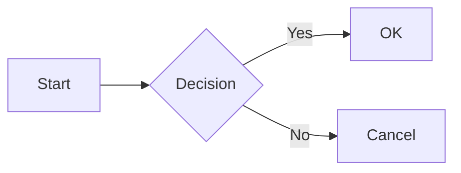

# Jekyll Mermaid Prebuild

[](https://rubygems.org/gems/jekyll-mermaid-prebuild)
[](https://codecov.io/gh/Texarkanine/jekyll-mermaid-prebuild)

Pre-render [Mermaid](https://mermaid.js.org/) diagrams to SVG at Jekyll build time, eliminating the need for client-side JavaScript.

## Why?

The mermaid.js library is **~2MB** minified. This plugin renders your diagrams to static SVG files during the Jekyll build, so your visitors don't need to download and execute any JavaScript.

## Features

- Converts mermaid code blocks to SVG files at build time
- Supports both backtick (`` ``` ``) and tilde (`~~~`) fenced code blocks
- Intelligent caching - only regenerates changed diagrams
- Clickable diagrams - link to full-size SVG for complex diagrams
- Configurable output directory

## Requirements

- Ruby >= 3.1.0
- Jekyll >= 4.0
- [mermaid-cli](https://github.com/mermaid-js/mermaid-cli) (`mmdc`)

### Installing mermaid-cli

```bash
npm install -g @mermaid-js/mermaid-cli
```

### Puppeteer Dependencies (Linux/WSL)

The mermaid CLI uses Puppeteer (headless Chrome). On Debian/Ubuntu/WSL, install the required libraries:

```bash
sudo apt-get update
sudo apt-get install -y libgbm1 libasound2 libatk1.0-0 \
  libatk-bridge2.0-0 libcups2 libdrm2 libxcomposite1 \
  libxdamage1 libxfixes3 libxrandr2 libxkbcommon0 \
  libpango-1.0-0 libcairo2 libnss3 libnspr4
```

## Installation

Add to your `Gemfile`:

```ruby
group :jekyll_plugins do
  gem "jekyll-mermaid-prebuild"
end
```

Run:

```bash
bundle install
```

## Usage

Write mermaid diagrams in your markdown using fenced code blocks:

~~~markdown

~~~

The plugin will automatically convert these to SVG files at build time.

### Output

The mermaid code block is replaced with:

```html
<figure class="mermaid-diagram">
  <a href="/assets/svg/abc12345.svg">
    
  </a>
</figure>
```

The image is wrapped in a link to itself, allowing users to click for a full-size view of complex diagrams.

## Configuration

Add to your `_config.yml`:

```yaml
mermaid_prebuild:
  enabled: true          # default: true
  output_dir: assets/svg # default: assets/svg
```

### Options

| Option | Default | Description |
|--------|---------|-------------|
| `enabled` | `true` | Enable/disable the plugin |
| `output_dir` | `assets/svg` | Directory for generated SVG files |

## Caching

Generated SVGs are cached in `.jekyll-cache/jekyll-mermaid-prebuild/`. The cache key is based on the diagram content, so:

- Unchanged diagrams are served from cache (fast rebuilds)
- Modified diagrams are automatically regenerated
- Different diagrams with different content get different cache keys

To clear the cache:

```bash
rm -rf .jekyll-cache/jekyll-mermaid-prebuild/
```

## Troubleshooting

### "mmdc not found"

Install the mermaid CLI:

```bash
npm install -g @mermaid-js/mermaid-cli
```

Verify installation:

```bash
mmdc --version
```

### "Puppeteer cannot launch headless Chrome"

Install the required system libraries (see [Puppeteer Dependencies](#puppeteer-dependencies-linuxwsl) above).

### Diagrams not converting

1. Check build output for `MermaidPrebuild:` messages
2. Verify mmdc works: `mmdc -i test.mmd -o test.svg`
3. Clear cache: `rm -rf .jekyll-cache/jekyll-mermaid-prebuild/`

## Development

### Setup

```bash
git clone https://github.com/Texarkanine/jekyll-mermaid-prebuild.git
cd jekyll-mermaid-prebuild
bundle install
```

### Testing

```bash
bundle exec rspec
```

### Code Quality

```bash
bundle exec rubocop
```

## Contributing

See [CONTRIBUTING.md](CONTRIBUTING.md) for development guidelines.
