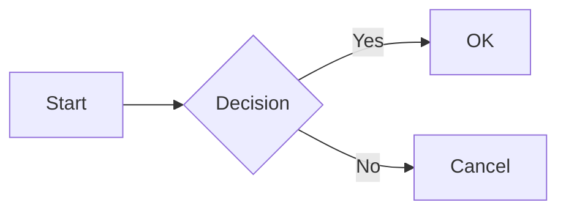

# Jekyll Mermaid Prebuild

[](https://rubygems.org/gems/jekyll-mermaid-prebuild)
[](https://codecov.io/gh/Texarkanine/jekyll-mermaid-prebuild)

Pre-render [Mermaid](https://mermaid.js.org/) diagrams to SVG at Jekyll build time, eliminating the need for client-side JavaScript.

## Why?

The mermaid.js library is **~2MB** minified. This plugin renders your diagrams to static SVG files during the Jekyll build, so your visitors don't need to download and execute any JavaScript.

## Features

- Converts mermaid code blocks to SVG files at build time
- Supports both backtick (`` ``` ``) and tilde (`~~~`) fenced code blocks
- Intelligent caching - only regenerates changed diagrams
- Clickable diagrams - link to full-size SVG for complex diagrams
- Configurable output directory

## Requirements

- Ruby >= 3.1.0
- Jekyll >= 4.0
- [mermaid-cli](https://github.com/mermaid-js/mermaid-cli) (`mmdc`)

### Installing mermaid-cli

```bash
npm install -g @mermaid-js/mermaid-cli
```

### Puppeteer Dependencies (Linux/WSL)

The mermaid CLI uses Puppeteer (headless Chrome). On Debian/Ubuntu/WSL, install the required libraries:

```bash
sudo apt-get update
sudo apt-get install -y libgbm1 libasound2 libatk1.0-0 \
  libatk-bridge2.0-0 libcups2 libdrm2 libxcomposite1 \
  libxdamage1 libxfixes3 libxrandr2 libxkbcommon0 \
  libpango-1.0-0 libcairo2 libnss3 libnspr4
```

## Installation

Add to your `Gemfile`:

```ruby
group :jekyll_plugins do
  gem "jekyll-mermaid-prebuild"
end
```

Run:

```bash
bundle install
```

## Usage

Write mermaid diagrams in your markdown using fenced code blocks:

~~~markdown

```mermaid
flowchart LR
  A[Start] --> B{Decision}
  B -->|Yes| C[OK]
  B -->|No| D[Cancel]
```
~~~

The plugin will automatically convert these to SVG files at build time.

### Output

The mermaid code block is replaced with:

```html
<figure class="mermaid-diagram">
  <a href="/assets/svg/abc12345.svg">
    
  </a>
</figure>
```

The image is wrapped in a link to itself, allowing users to click for a full-size view of complex diagrams.

## Configuration

Add to your `_config.yml`:

```yaml
mermaid_prebuild:
  enabled: true          # default: true
  output_dir: assets/svg # default: assets/svg
  prefers_color_scheme:
    mode: light          # light (default) | dark | auto — see [Color scheme](#color-scheme-mermaid-theme)
    # Optional: override mmdc’s root SVG background (defaults: light=white, dark=black)
    # background_color:
    #   light: white
    #   dark: black
  postprocessing:
    text_centering: true         # default: true
    overflow_protection: true    # default: true
    edge_label_padding: 0        # default: 0 (off); try 4-8 if needed
    emoji_width_compensation:    # optional, see below
      flowchart: true
```

### Options

| Option | Default | Description |
|--------|---------|-------------|
| `enabled` | `true` | Enable/disable the plugin |
| `output_dir` | `assets/svg` | Directory for generated SVG files |
| `prefers_color_scheme` | see below | **Hash** with `mode` (`light` / `dark` / `auto`) and optional `background_color` (or `background-color`) for chart backgrounds. See [Color scheme](#color-scheme-mermaid-theme). |

#### `postprocessing` group

All cross-browser rendering fixes live under the `postprocessing:` key. Each can be toggled independently.

| Option | Default | Description |
|--------|---------|-------------|
| `text_centering` | `true` | Inject CSS to center `<foreignObject>` label text. Set `false` to disable. See [Cross-browser text rendering fixes](#cross-browser-text-rendering-fixes). |
| `overflow_protection` | `true` | Inject `overflow: visible` on `<foreignObject>` elements to prevent clipping. Set `false` to disable. See [Cross-browser text rendering fixes](#cross-browser-text-rendering-fixes). |
| `edge_label_padding` | `0` | Extra SVG user units added to edge-label `<foreignObject>` widths after mmdc (off when `0`, `false`, or omitted). Applies to all diagram types. See [Cross-browser text rendering fixes](#cross-browser-text-rendering-fixes). |
| `emoji_width_compensation` | `{}` | Map of diagram types to booleans; see [Emoji width compensation](#emoji-width-compensation) below. |

### Color scheme (Mermaid theme)

`prefers_color_scheme` must be a **YAML mapping** (hash). Use `mode` for the Mermaid theme / HTML behavior. You may also set per-variant **root SVG background** colors (mmdc always emits `background-color: white` on the root `<svg>`; the plugin rewrites that for each output file).

**Top-level key:** `prefers_color_scheme` or `prefers-color-scheme` (hyphenated alias).

```yaml
mermaid_prebuild:
  prefers_color_scheme:
    mode: auto
    background_color:      # or: background-color
      light: white         # default if omitted
      dark: black          # default if omitted
```

| `mode` | Behavior |
|--------|----------|
| `light` | One SVG per diagram using Mermaid’s default (light) theme. |
| `dark` | One SVG per diagram using mmdc’s dark theme (`mmdc -t dark`). |
| `auto` | Two SVGs per diagram: `{digest}.svg` (light) and `{digest}-dark.svg` (dark). The embedded HTML uses two links with a small inline stylesheet so only the variant matching the visitor’s `prefers-color-scheme` is shown. **Build cost:** each diagram runs `mmdc` twice until both files are cached. |

**Chart backgrounds:** Values are injected verbatim into the root `<svg style="...">` as the CSS token after `background-color:` (for example `white`, `black`, `#fff0aa`, `rgb(0,0,0)`, `transparent`). They are validated conservatively: values containing quotes, angle brackets, backticks, semicolons, backslashes, or control characters are rejected and the default for that slot is used, with a warning. Keep values short (max 256 characters). **Do not** put raw double quotes or HTML in these strings.

If `prefers_color_scheme` is not a hash (for example a bare string), the plugin uses `mode: light` and default backgrounds and logs a warning. Unknown `mode` values fall back to `light` with a warning. Omitting `mode` is treated as `light`.

The cache digest includes `mode` and both background strings so theme and color changes never reuse the wrong SVG.

### Cross-browser text rendering fixes

When mmdc renders a diagram, headless Chromium measures text with `getBoundingClientRect()` and sets each `<foreignObject>` to exactly that width. If the viewing browser (different OS, different fonts) renders the same text at a different width, labels can clip or shift. The plugin can apply some fixes to every generated SVG (all configurable under `postprocessing:`):

1. **Text centering** (`text_centering: true`, default on): Mermaid's CSS sets `text-align: center` on SVG `<g>` elements, but that has no effect on HTML inside `<foreignObject>`. The plugin injects a CSS rule (`foreignObject > div { display: block !important; text-align: center }`) so that label text centers within its container regardless of font metric differences. This is idempotent - if upstream Mermaid fixes this, the rule becomes redundant but harmless.

2. **Overflow protection** (`overflow_protection: true`, default on): SVG `<foreignObject>` elements default to `overflow: hidden`, which silently clips any text that renders wider than the container. Since different build environments can produce foreignObject widths that differ by 7–22% (ish) for identical Mermaid source, the plugin injects `foreignObject { overflow: visible }` so that labels are never truncated regardless of the magnitude of measurement mismatch. This covers both node and edge labels across all diagram types. This *could* result in labels extending beyond the bounds of their container if there was no natural padding; most cases have a few pixels of padding to spare and so this will just seamlessly fix things.

3. **Edge label padding** (opt-in via `edge_label_padding`): A fixed-pixel widening of **edge** label `<foreignObject>` elements across all diagram types. Edge labels have their own background rectangles, so `overflow: visible` alone can cause text to spill outside the background. Padding widens the container so the background matches the visible text.

   - **When to enable:** If your CI builds produce narrower edge labels than the viewing browser expects. Complements `overflow_protection` for edge labels specifically.
   - **Starting value:** Try `4`-`8` (SVG user units); increase only if needed.
   - **Caching:** The cache key includes this padding, so changing the value invalidates all cached SVGs.

### Emoji width compensation

Headless Chromium (used by mermaid-cli/mmdc) [undermeasures emoji glyph widths](https://stackoverflow.com/q/42016125) on non-Mac platforms. That can make node labels containing emoji clip in the generated SVG. This option tells the plugin to **append invisible `&nbsp;` padding** to emoji-containing node labels *before* passing the source to mmdc, so Puppeteer allocates correct widths.

This is a **monkeypatch** for an upstream headless Chromium bug, not a general-purpose fix. It works within specific constraints; if upstream Chromium or Mermaid fix the emoji width measurement, disable this feature.

- **When to enable:** Only if you see emoji text clipping in mmdc-rendered SVGs on your build platform (typically Linux/Windows).
- **When not to enable:** Mac build environments (emoji measure correctly there), or if upstream Chromium/mermaid fixes the issue - extra padding would then over-widen nodes.
- **Why it's in the plugin:** Adding `&nbsp;` manually in your Mermaid source would break GitHub preview, IDE preview, mermaid.live, and client-side mermaid.js, because those contexts don't have the headless-Chrome bug. The plugin injects padding only for the mmdc path, so your source stays clean everywhere.

#### Requirements for emoji compensation to work

The plugin uses regex to find node labels in Mermaid source. This means your source must follow these conventions for compensation to apply:

1. **Use double-quoted labels** on nodes with emoji: `A["🔧 Code"]`, not `A[🔧 Code]`
2. **Use `<br>` for line breaks** inside labels (variants `<br/>` and `<br />` also work)
3. **Flowchart only** - `flowchart` and `graph` diagrams. Other diagram types are not supported for automatic compensation.

Labels that don't match these patterns pass through unmodified - the plugin won't break your diagrams, it just won't compensate them.

#### Multi-line label behavior

For labels with `<br>` line breaks, the plugin only pads the **longest line** (if it contains emoji). Shorter lines center naturally within the container sized by the longest line. If the longest line has no emoji, no padding is applied - Puppeteer measures non-emoji text correctly, so the container is already the right size.

#### Fallback: manual `&nbsp;`

If you have a label that falls outside the supported patterns (e.g. Mermaid markdown strings with backtick delimiters), you can manually add `&nbsp;` entities to the label in your Mermaid source. Note that manual `&nbsp;` will render as visible trailing space in non-mmdc contexts (GitHub preview, mermaid.live, etc.).

#### Example config

```yaml
mermaid_prebuild:
  postprocessing:
    emoji_width_compensation:
      flowchart: true
```

## Caching

Generated SVGs are cached in `.jekyll-cache/jekyll-mermaid-prebuild/`. The cache key is based on the diagram content and all output-affecting postprocessing config, so:

- Unchanged diagrams are served from cache (fast rebuilds)
- Modified diagrams are automatically regenerated
- Different diagrams with different content get different cache keys
- Enabling or disabling emoji width compensation for a diagram type invalidates cache for that content (keys include compensated source when applicable)
- Changing `edge_label_padding`, `text_centering`, `overflow_protection`, `prefers_color_scheme` mode, or chart background colors invalidates cache keys

To clear the cache:

```bash
rm -rf .jekyll-cache/jekyll-mermaid-prebuild/
```

## Troubleshooting

### "mmdc not found"

Install the mermaid CLI:

```bash
npm install -g @mermaid-js/mermaid-cli
```

Verify installation:

```bash
mmdc --version
```

### "Puppeteer cannot launch headless Chrome"

Install the required system libraries (see [Puppeteer Dependencies](#puppeteer-dependencies-linuxwsl) above).

### Diagrams not converting

1. Check build output for `MermaidPrebuild:` messages
2. Verify mmdc works: `mmdc -i test.mmd -o test.svg`
3. Clear cache: `rm -rf .jekyll-cache/jekyll-mermaid-prebuild/`

## Development

### Setup

```bash
git clone https://github.com/Texarkanine/jekyll-mermaid-prebuild.git
cd jekyll-mermaid-prebuild
bundle install
```

### Testing

```bash
bundle exec rspec
```

### Code Quality

```bash
bundle exec rubocop
```

## Contributing

See [CONTRIBUTING.md](CONTRIBUTING.md) for development guidelines.
