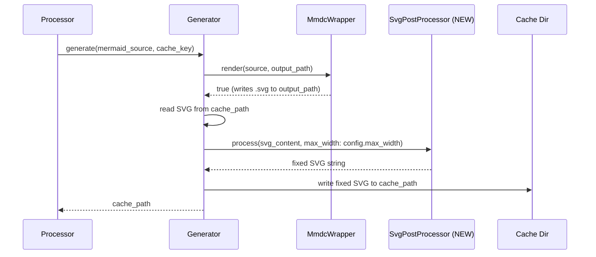
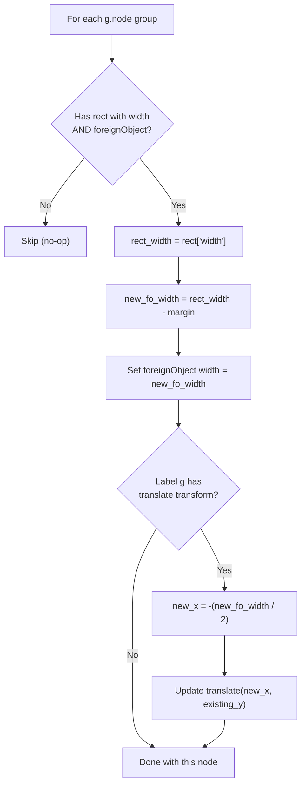

# Task: svg-post-processing

* Task ID: svg-post-processing
* Complexity: Level 3
* Type: feature

Add SVG post-processing to fix mmdc's foreignObject text clipping bug and support configurable `max_width` constraints. Introduces a new `SvgPostProcessor` module that runs after every mmdc render and before caching. The foreignObject fix always applies (bug correction); the `max_width` configuration is an optional enhancement for fixed-width sites. Without `max_width`, the hardcoded `max-width` inline style is removed, enabling responsive scaling.

## Pinned Info

### Pipeline (Post-Processing Integration)

Call order: where `SvgPostProcessor` sits in the existing pipeline.

### foreignObject Fix Logic

The core bug: mmdc's Puppeteer rendering produces `<foreignObject>` elements narrower than their parent `<rect>`, clipping node label text. The fix widens `foreignObject` to match `rect` (minus margin) and re-centers the label `<g>` transform.

## Component Analysis

### Affected Components

- **Configuration** (`lib/jekyll-mermaid-prebuild/configuration.rb`): Parses site config → Add `max_width` optional integer parameter with validation
- **SvgPostProcessor** (`lib/jekyll-mermaid-prebuild/svg_post_processor.rb`): **NEW** — Stateless utility module for SVG XML manipulation via Nokogiri
- **Generator** (`lib/jekyll-mermaid-prebuild/generator.rb`): Orchestrates mmdc render + caching → Add post-processing step between render and cache write
- **Processor** (`lib/jekyll-mermaid-prebuild/processor.rb`): Finds mermaid blocks, computes cache keys → Include `max_width` in cache key computation
- **Main require** (`lib/jekyll-mermaid-prebuild.rb`): Module requires → Add `svg_post_processor` require
- **Gemspec** (`jekyll-mermaid-prebuild.gemspec`): Dependencies → Add `nokogiri` runtime dependency

### Cross-Module Dependencies

- `Processor` → `DigestCalculator`: cache key computation (Processor changes HOW it calls, DigestCalculator unchanged)
- `Processor` → `Generator`: passes cache_key (unchanged interface)
- `Generator` → `MmdcWrapper`: render call (unchanged)
- `Generator` → `SvgPostProcessor` **(NEW)**: post-process after render
- `Generator` → `Configuration`: reads `max_width` (already has config ref)
- `SvgPostProcessor` → Nokogiri: XML parsing **(NEW external dependency)**

### Boundary Changes

- **Configuration**: New public accessor `max_width` (additive, non-breaking)
- **SvgPostProcessor**: New module with public `process` method
- **DigestCalculator**: No interface change (caller changes how it provides input)
- **Generator**: No public API change (post-processing is internal)

### Invariants & Constraints

1. Post-processing must be a no-op for SVGs without node groups (sequence diagrams, etc.)
2. Cache key must change when `max_width` changes (including nil → integer transition)
3. Existing cached SVGs must auto-invalidate after upgrade (cache key format change handles this)
4. Do NOT change mmdc invocation (flags, args, env)
5. Preserve visual appearance aside from fixing clipping and width constraints
6. Follow `module_function` pattern for stateless utility modules

## Open Questions

None — implementation approach is clear.

Design decisions made without creative phase:
- **min_width**: Deferred. CSS layout concern, not plugin responsibility. Can be added later without architectural impact.
- **viewBox adjustment**: Not needed. foreignObject fix constrains content within existing rect bounds already inside viewBox.
- **mmdc `--width` flag**: Not used. The foreignObject bug is in text measurement, not viewport. Post-processing is the correct fix.
- **Always post-process**: Yes. foreignObject fix is a bug correction benefiting all users. `max_width` is an additional optional constraint.
- **Cache migration**: Handled automatically — new cache key format (includes max_width metadata) differs from old format, causing one-time regeneration on first build after upgrade.

## Test Plan (TDD)

### Behaviors to Verify

#### SvgPostProcessor

- **B1**: foreignObject narrower than parent rect → width corrected to `rect_width - 8px`
- **B2**: Label `<g>` transform re-centered after foreignObject widening
- **B3**: foreignObject already matches rect width → no change
- **B4**: SVG without node groups → returned unchanged (no-op)
- **B5**: Root `<svg>` `max-width` removed when no `max_width` configured
- **B6**: Root `<svg>` `max-width` set to configured value when `max_width` provided
- **B7**: Root `<svg>` without style attribute → no error
- **B8**: Other inline styles on root `<svg>` preserved (only `max-width` affected)
- **B9a**: Root `<svg>` always has `width="100%"` after post-processing (defensive set)

#### Configuration

- **B9**: `max_width` defaults to nil when not configured
- **B10**: `max_width` parses positive integer from config
- **B11**: `max_width` rejects zero and negative values → nil
- **B12**: `max_width` rejects non-integer values (string, float, boolean) → nil

#### Generator

- **B13**: Post-processing called after successful mmdc render
- **B14**: Post-processed content written to cache file
- **B15**: `max_width` from config passed to SvgPostProcessor
- **B16**: Failed mmdc render does not invoke post-processing

#### Processor (cache key)

- **B17**: Same diagram source + different `max_width` → different cache keys
- **B18**: `max_width=nil` → cache key differs from legacy format (auto-migration)

### Test Infrastructure

- Framework: RSpec (configured in `.rspec`)
- Test location: `spec/jekyll_mermaid_prebuild/`
- Conventions: One spec file per module, `instance_double` for dependencies, `@temp_dir` via `around` block
- New test files: `spec/jekyll_mermaid_prebuild/svg_post_processor_spec.rb`

### Integration Tests

- No new integration tests needed. The post-processing is purely functional (string in → string out) and tested via unit tests. The Generator spec already mocks MmdcWrapper and tests the orchestration.

## Implementation Plan

### Step 1: Add Nokogiri dependency

- Files: `jekyll-mermaid-prebuild.gemspec`
- Changes: Add `spec.add_dependency "nokogiri", ">= 1.13"` alongside the Jekyll dependency
- Validation: `bundle install` succeeds

### Step 2: Configuration — add `max_width` (TDD cycle)

- Files: `spec/jekyll_mermaid_prebuild/configuration_spec.rb`, `lib/jekyll-mermaid-prebuild/configuration.rb`
- Tests: B9, B10, B11, B12
- Changes:
  - Add `attr_reader :max_width`
  - Parse `config["max_width"]` with validation (positive integer or nil)
  - Add private `parse_max_width` method

### Step 3: SvgPostProcessor — new module (TDD cycle)

- Files: `spec/jekyll_mermaid_prebuild/svg_post_processor_spec.rb` (NEW), `lib/jekyll-mermaid-prebuild/svg_post_processor.rb` (NEW), `lib/jekyll-mermaid-prebuild.rb`
- Tests: B1, B2, B3, B4, B5, B6, B7, B8, B9a
- Changes:
  - New module with `module_function` pattern
  - Public: `process(svg_content, max_width: nil)` → returns post-processed SVG string
  - Private: `fix_foreign_object_widths(doc)`, `adjust_root_svg_width(doc, max_width)` (also defensively sets `width="100%"` on root SVG)
  - Add `require_relative` in main module file

### Step 4: Generator — integrate post-processing (TDD cycle)

- Files: `spec/jekyll_mermaid_prebuild/generator_spec.rb`, `lib/jekyll-mermaid-prebuild/generator.rb`
- Tests: B13, B14, B15, B16
- Changes:
  - After `MmdcWrapper.render` succeeds: read SVG from `cache_path`, call `SvgPostProcessor.process(svg_content, max_width: @config.max_width)`, write result back to `cache_path`
  - Existing mock setup in specs writes SVG content to file — adjust to verify post-processing
  - **Preflight note**: Update existing `instance_double` for Configuration to include `max_width: nil` (or appropriate value) to avoid RSpec "unexpected message" errors

### Step 5: Processor — cache key includes max_width (TDD cycle)

- Files: `spec/jekyll_mermaid_prebuild/processor_spec.rb`, `lib/jekyll-mermaid-prebuild/processor.rb`
- Tests: B17, B18
- Changes:
  - `convert_block`: compute cache key as `DigestCalculator.content_digest("#{mermaid_source}\x00max_width=#{@config.max_width}")` instead of `DigestCalculator.content_digest(mermaid_source)`
  - This naturally invalidates all pre-existing caches (format change)
  - **Preflight note**: Update existing `instance_double` for Configuration to include `max_width: nil` in all existing test contexts

### Step 6: Documentation

- Files: `README.md`
- Changes:
  - Add `max_width` to Configuration section and Options table
  - Add note about SVG post-processing in Features section
  - Update Caching section to note `max_width` affects cache keys

## Technology Validation

- **Nokogiri** (new runtime dependency): Standard Ruby XML library. Not currently in the gem's dependency tree (verified via `bundle list`). Will be added to gemspec and validated with `bundle install`. Nokogiri >= 1.13 supports Ruby >= 3.0, compatible with this gem's Ruby >= 3.3.0 requirement.

## Challenges & Mitigations

- **SVG namespace handling**: Nokogiri requires namespace-aware XPath. mmdc SVGs use the default SVG namespace. Mitigation: use namespace prefix mapping (`'svg' => 'http://www.w3.org/2000/svg'`) consistently in all XPath queries, as shown in the planning doc pseudocode.
- **Diverse diagram types**: Not all Mermaid diagrams produce `g.node` groups with rect + foreignObject. Mitigation: all fixes are guarded by presence checks (`next unless rect && fo`), making them inherently no-op for non-matching structures.
- **Transform parsing**: The label `<g>` transform is a `translate(x, y)` string that needs regex parsing. Mitigation: strict regex match (`/translate\(([-\d.]+),\s*([-\d.]+)\)/`); skip re-centering if transform format is unexpected.
- **Nokogiri XML output**: `doc.to_xml` may add XML declaration or change whitespace. Mitigation: test that output is valid SVG; use `doc.to_xml(save_with: Nokogiri::XML::Node::SaveOptions::AS_XML)` if needed to control output format.
- **Cache migration on upgrade**: Existing cached SVGs lack post-processing. Mitigation: cache key format change auto-invalidates old entries (one-time regeneration on first build).

## Status

- [x] Component analysis complete
- [x] Open questions resolved
- [x] Test planning complete (TDD)
- [x] Implementation plan complete
- [x] Technology validation complete
- [x] Preflight (PASS — minor amendments applied)
- [x] Build (COMPLETE — 76/76 tests pass, RuboCop clean)
- [x] QA (PASS — 2 trivial fixes applied; all requirements verified)
