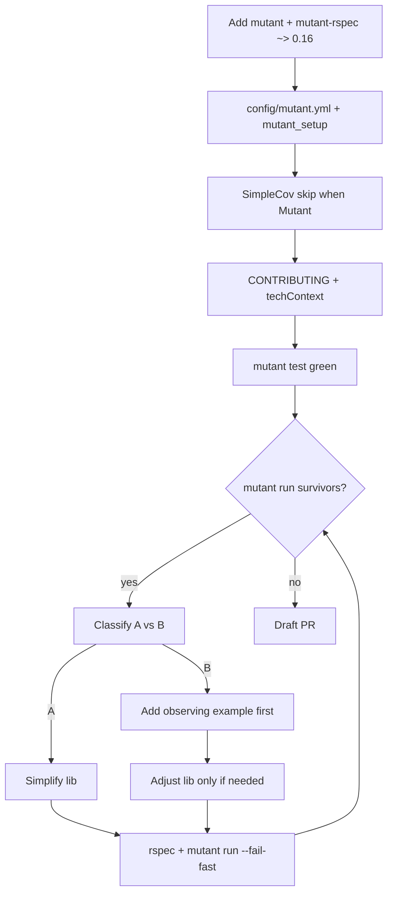

# Task: mutation-testing

* Task ID: mutation-testing
* Complexity: Level 3
* Type: feature (dev tooling / quality gate)

Wire Mutant + `mutant-rspec` into jekyll-mermaid-prebuild using the jekyll-auto-thumbnails reference pattern, document kill discipline, drive mutation coverage to 100%, and open a draft PR on `feat/mutation-testing`. CI Mutant job is out of scope.

## Pinned Info

### Mutant adopt + kill flow

Why pinned: the whole task is this loop; every implementation step sits on it.

## Component Analysis

### Affected Components
- **Gemspec / Bundler**: declare `mutant`, `mutant-rspec` `~> 0.16` → lockfile update
- **Mutant config**: new `config/mutant.yml` (rspec integration, `JekyllMermaidPrebuild*` subjects, require `mutant_setup`)
- **Spec harness**: `spec/support/mutant_setup.rb`; `spec/spec_helper.rb` SimpleCov skipped when `defined?(Mutant)`
- **Docs**: `CONTRIBUTING.md` Mutation Testing section; `memory-bank/techContext.md` Testing Process
- **Lib modules under mutation**: `Configuration`, `Generator`, `Processor`, `Hooks`, `MmdcWrapper`, `DigestCalculator`, `EmojiCompensator`, `SvgPostProcessor`, `VERSION` — kill-loop edits only as survivors demand (prefer `def self.` over `module_function`; no SUT stubs)
- **Specs**: expand observing examples; remodel any SUT stubs (notably `mmdc_wrapper_spec` stubbing `described_class`)

### Cross-Module Dependencies
- Mutant loads `mutant_setup` → requires gem → RSpec selects examples by describe-prefix match to subject
- Generator → MmdcWrapper (collaborator stubs OK); Processor → Generator (inject/stub Generator collaborator, not Processor SUT methods)
- Hooks → site.data shared Configuration/Generator/Processor

### Boundary Changes
- Public call sites on utility modules stay module-level (`Module.method`); converting `module_function` → `def self.` preserves the public API shape used by production
- No product feature API changes intended; behavior-preserving simplifications (Bucket A) only when unobserved

### Invariants & Constraints
- Must preserve 100% (or project-target) SimpleCov line coverage under normal `bundle exec rspec`
- Must reach 100% mutation kill with no matcher ignores / `coverage_criteria:` tweaks
- Must not stub/mock SUT; must not use `send`/`__send__` for private methods just for Mutant
- CI Mutant job remains a non-goal
- Must match auto-thumbnails pattern (opensource usage, rspec integration, mutant_setup require)

## Open Questions

None - implementation approach is clear from the auto-thumbnails archive and reference files. Creative phase skipped.

Resolved by brief/constraints (not creative):
- Keep RSpec (`mutant-rspec`), not minitest
- Mutant 0.16 CLI: `mutant test` / `mutant run`
- Prefer `def self.` over `module_function` when Mutant invents unused instance subjects

## Test Plan (TDD)

### Behaviors to Verify

- Scaffold: Mutant config loads; `bundle exec mutant test` runs the RSpec suite under Mutant without SimpleCov interference → exit 0
- Discipline docs present and accurate (manual/doc review; no meta-specs of CONTRIBUTING)
- Per-survivor Bucket B: missing observation → add example that fails under the mutant / asserts intentional behavior → then keep lib
- Per-survivor Bucket A: redundant behavior → simplify lib so mutant has nothing to delete; suite stays green
- Remodel: `MmdcWrapper` availability/render paths observed via collaborator stubs (`Open3`, PATH/`which`) not `allow(described_class)`
- End gate: `bundle exec rspec` green + `bundle exec mutant run` 100% kill

### Test Infrastructure

- Framework: RSpec (`.rspec`, `spec/spec_helper.rb`)
- Test location: `spec/jekyll_mermaid_prebuild/*_spec.rb`
- Conventions: `RSpec.describe ModuleOrClass`, nested `describe ".method"` / `#method`, `expect` syntax, tempdir around examples
- New test files: none expected for scaffold; kill-loop adds examples in existing specs. Optional: no `AGENTS.md` unless needed — discipline lives in CONTRIBUTING like auto-thumbnails

### Integration Tests

- Hooks registration / lifecycle: if Mutant or SimpleCov leaves unobserved hook bodies, add `Jekyll::Hooks.trigger` style examples under hooks describe (same lesson as auto-thumbnails)
- Processor×Generator: keep Generator as collaborator double; observe Processor public behavior

## Implementation Plan

1. **Declare Mutant deps** (bundle)
    - Files: `jekyll-mermaid-prebuild.gemspec`, `Gemfile.lock`
    - Changes: `add_development_dependency "mutant", "~> 0.16"` and `"mutant-rspec", "~> 0.16"`; `bundle install`
    - TDD: after install, verification is `bundle exec mutant --version` / later `mutant test` (no product test yet)

2. **Add Mutant config + setup** (harness)
    - Files: `config/mutant.yml`, `spec/support/mutant_setup.rb`
    - Changes: mirror auto-thumbnails with `matcher.subjects: [JekyllMermaidPrebuild*]`, `integration.name: rspec`, `requires: ./spec/support/mutant_setup.rb`, `usage: opensource`; setup requires `"jekyll-mermaid-prebuild"`
    - TDD: `bundle exec mutant test` must pass (suite under Mutant) before analyzing mutations — this is the red/green gate for the harness

3. **Skip SimpleCov under Mutant**
    - Files: `spec/spec_helper.rb`
    - Changes: wrap SimpleCov require/start in `unless defined?(Mutant)` (match auto-thumbnails)
    - TDD: re-run `bundle exec mutant test` (green); `bundle exec rspec` still produces coverage when Mutant absent

4. **Document discipline**
    - Files: `CONTRIBUTING.md`, `memory-bank/techContext.md`
    - Changes: Mutation Testing section (commands, A/B buckets, constraints); techContext Testing Process Mutant CLI note
    - TDD: N/A for prose; verify content against reference CONTRIBUTING

5. **Convert `module_function` → `def self.` preemptively on utility modules** (known Mutant subject hygiene)
    - Files: `digest_calculator.rb`, `emoji_compensator.rb`, `hooks.rb`, `mmdc_wrapper.rb`, `svg_post_processor.rb`
    - Changes: replace `module_function` + instance defs with `def self.` class methods; keep public call sites identical
    - TDD: **first** ensure existing specs for each module still express public API; run those specs after conversion (suite must stay green). No new behavior — structure change only.

6. **Remodel SUT stubs in MmdcWrapper specs** (discipline prerequisite)
    - Files: `spec/jekyll_mermaid_prebuild/mmdc_wrapper_spec.rb`, possibly `lib/.../mmdc_wrapper.rb` if seams needed for collaborator injection without private `send`
    - Changes: stop `allow(described_class).to receive(...)`; stub `Open3` / filesystem / PATH collaborators so real module methods run
    - TDD: rewrite/adjust examples **first** so they fail if SUT path is wrong; then adjust lib only if a public seam is required; `bundle exec rspec spec/jekyll_mermaid_prebuild/mmdc_wrapper_spec.rb`

7. **Kill loop to 100%**
    - Files: any surviving subjects under `lib/` + matching specs
    - Process per survivor:
        1. Classify A vs B (ask if unsure — prefer B when behavior looks intentional)
        2. **Bucket B:** write/adjust observing example under the subject's describe-prefix **first**; run example (expect fail or weak assertion gap); strengthen; keep lib
        3. **Bucket A:** simplify implementation; re-run focused specs
        4. `bundle exec mutant run --fail-fast` then continue until full `bundle exec mutant run` is 100%
    - Prefer inventory-all-survivors once after first green `mutant test`, then batch by structural cause

8. **Final verification + draft PR**
    - Run full `bundle exec rspec` and `bundle exec mutant run`
    - Update memory-bank progress/tasks; open draft PR via `gh pr create --draft` on `feat/mutation-testing`

## Technology Validation

New dependencies: `mutant` + `mutant-rspec` `~> 0.16` (opensource usage).

PoC (executed in Plan): added deps + `config/mutant.yml` + `spec/support/mutant_setup.rb` + SimpleCov Mutant guard; `bundle exec mutant test` → **158 tests, 0 failed** (Runtime ~1.08s). Harness pattern validated; remaining Plan steps 4–8 still for Build.

## Challenges & Mitigations

- **SUT stubs in mmdc_wrapper_spec**: Remodel to collaborator stubs early (step 6) before kill loop burns time on unkillable subjects
- **module_function instance subjects**: Convert to `def self.` (step 5) before deep kill
- **mutant-rspec describe-prefix selection**: Place side-effect observations under the method's describe, not sibling describes
- **Parallel Mutant forks + shared fixtures**: Prefer per-example tempdirs (already largely present via spec_helper `around`)
- **mmdc / Puppeteer slowness**: Keep existing Generator/Mmdc collaborator stubs for heavy paths; do not invoke real mmdc in unit kill path
- **Hook register bodies unobserved by SimpleCov/Mutant**: Add Hooks.trigger examples if survivors or coverage demand

## Pre-Mortem

- **Plan fails because kill loop treats SUT stubs as Bucket B forever**: already covered by Challenge + step 6 — do remodel before kill inventory
- **Plan fails by inventing a different Mutant pattern (minitest / ignore lists)**: constrained by brief; preflight checks mirror of auto-thumbnails files
- **Plan fails by under-scoping docs (techContext / CONTRIBUTING)**: steps 4 and acceptance criteria explicit
- **Calendar blowup from linear --fail-fast only**: inventory survivors once after PoC (Challenge/insight from auto-thumbnails archive)

## Status

- [x] Component analysis complete
- [x] Open questions resolved
- [x] Test planning complete (TDD)
- [x] Implementation plan complete
- [x] Technology validation complete
- [x] Pre-Mortem complete
- [x] Preflight
- [x] Build
- [x] QA

## QA Results

- **PASS** — Requirements 1–5 satisfied; draft PR is Reflect/delivery step 8 remainder.
- No ignore/`coverage_criteria` cheats; no SUT stubs/`send` for Mutant; `def self.` pattern matches systemPatterns.
- Trivial fixes: none. Substantive issues: none.
- Gates re-confirmed from Build: RSpec 407/0, SimpleCov 100%, RuboCop clean, Mutant 100%.

## Preflight Findings

- **PASS** — TDD ordering encoded per implementable unit (steps 5–7 explicit test-first; harness gated by `mutant test`).
- Convention: Mutant files match auto-thumbnails; intentional `module_function` → `def self.` documented as Mutant hygiene (updates `systemPatterns` wording in Build if needed).
- Completeness: requirements 1–6 mapped to steps 1–8; CI Mutant job correctly out of scope.
- **Advisory (deferred):** optional `rake mutant` wrapper — same deferral as auto-thumbnails; CLI fidelity first.
