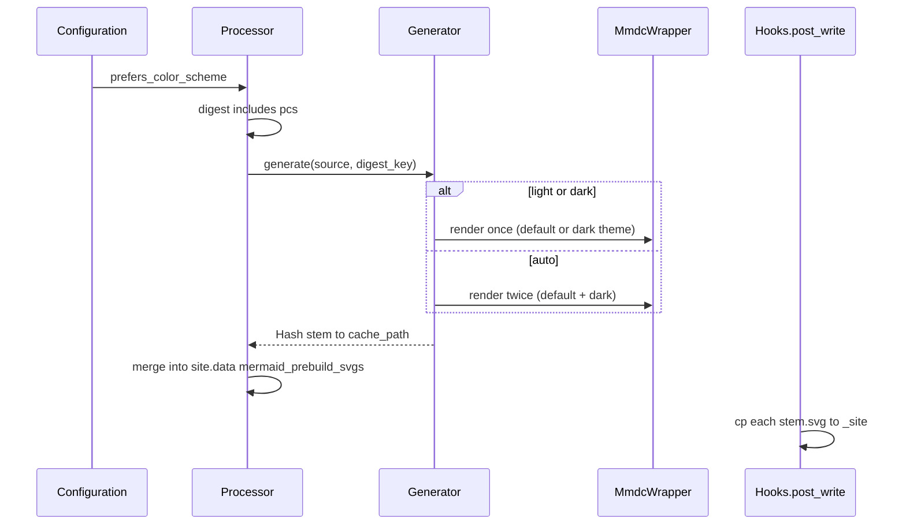

# Task: Dark mode / prefers-color-scheme (issue #11)

* **Task ID:** `issue-11-prefers-color-scheme`
* **Complexity:** Level 3
* **Type:** feature

Add `mermaid_prebuild.prefers_color_scheme` (`light` default, `dark`, `auto`). `light` keeps current single-SVG default theme; `dark` renders one SVG with Mermaid CLI dark theme; `auto` renders `{digest}.svg` (light) and `{digest}-dark.svg` (dark) and embeds two `<a>` elements (one per variant) with CSS `@media (prefers-color-scheme: dark)` toggling visibility so the correct link + image is shown for the user's preference. Digest input must include the mode so cache entries do not cross themes.

## Pinned Info

### Build-time flow (config → SVGs → site)

High-level sequence for implementers: one `Configuration` per build; `Processor` asks `Generator` for one or two cache files; `Hooks.copy_svgs_to_site` already copies any `stem => path` map to `dest/output_dir/{stem}.svg`.

## Component Analysis

### Affected Components

- **`Configuration`** (`lib/jekyll-mermaid-prebuild/configuration.rb`): Parse `mermaid_prebuild.prefers_color_scheme` from site config. Normalize to internal enum `:light`, `:dark`, `:auto`. Invalid/missing → `:light` and `Jekyll.logger.warn` (same pattern as other defensive config in the codebase).
- **`MmdcWrapper`** (`lib/jekyll-mermaid-prebuild/mmdc_wrapper.rb`): Extend `render` with a `theme` (or boolean `dark:`) argument; append `-t`, `dark` to argv when generating the dark variant. `test_render` may remain default theme (smoke test only); document in plan if changed.
- **`Generator`** (`lib/jekyll-mermaid-prebuild/generator.rb`): Branch on `config.prefers_color_scheme`. Produce one or two files under cache dir: `#{digest}.svg` and optionally `#{digest}-dark.svg`. Run `post_process_svg` on each file written or refreshed. **Change `generate` return type** from `String|nil` to `Hash<String,String>|nil`: keys are **file stems** (e.g. `abc12345`, `abc12345-dark`) matching `Hooks` destination names. Return `nil` if any required `mmdc` call fails. Extend `build_figure_html` to accept optional dark URL and emit **two `<a>` elements** (`.mermaid-diagram__light` visible by default, `.mermaid-diagram__dark` hidden via `style="display:none"`) with an inline `<style>` block containing `@media (prefers-color-scheme: dark)` that swaps visibility; keep `<figure class="mermaid-diagram">` wrapper.
- **`Processor`** (`lib/jekyll-mermaid-prebuild/processor.rb`): Append `prefers_color_scheme` (and any future theme-affecting flag) to `digest_string_for_cache`. Update `convert_block` to merge **all** entries from `generator.generate` into `svgs_to_copy`, and build HTML via the updated `build_figure_html`.
- **`Hooks`** (`lib/jekyll-mermaid-prebuild/hooks.rb`): No logic change expected if `copy_svgs_to_site` already uses dynamic `#{cache_key}.svg` (it does).
- **`README.md`**: Document key, values, `auto` behavior (two files, CSS-toggled `<a>` elements), and build cost (double `mmdc` for `auto`).

### Cross-Module Dependencies

- `Processor` → `Generator` → `MmdcWrapper` + `Configuration`.
- `Hooks` ← `site.data["mermaid_prebuild_svgs"]` populated by `Processor` (unchanged contract: string keys → absolute cache paths).

### Boundary Changes

- **`Generator#generate`**: Return `Hash<String,String>|nil` instead of `String|nil` (internal to gem; only `Processor` calls it).
- **`Generator#build_figure_html`**: Signature gains optional keyword `dark_url:` for `auto` HTML (two `<a>` + CSS toggle instead of `<picture>`).

### Alignment with `systemPatterns.md`

- Shared state remains `site.data["mermaid_prebuild_*"]`; fence parsing unchanged; content-based caching preserved with extended digest inputs.
- No global singletons introduced.

### Invariants

- Default site behavior unchanged when key omitted (`light`).
- Nested mermaid fences still ignored.
- Cache directory layout remains under `Configuration::CACHE_DIR`; only additional filenames for `auto`.
- `mmdc` missing / Puppeteer failure paths unchanged at hook level.

## Open Questions

None — implementation approach is clear (per `projectbrief.md` investigation: `mmdc -t dark`, `{digest}-dark.svg`; preflight resolved HTML strategy: two `<a>` elements with CSS `@media (prefers-color-scheme: dark)` toggle instead of `<picture>`, so the click-through link is always correct for the user's color scheme).

## Test Plan (TDD)

### Behaviors to Verify

- **Config default:** no `prefers_color_scheme` → `Configuration#prefers_color_scheme` is `:light` (or documented equivalent).
- **Config explicit:** `light` / `dark` / `auto` (string or symbol) parse correctly.
- **Config invalid:** unknown value → `:light` + warning logged.
- **MmdcWrapper:** `render(..., theme: :dark)` (or agreed API) invokes `Open3.capture3` with `-t` and `dark`; default theme omits `-t`.
- **Generator light:** cache miss → one render (default theme), returns `{ digest => path }`; cache hit returns same without `render`.
- **Generator dark:** single file, `render` with dark theme.
- **Generator auto:** two stems in hash; both post-processed; if one file exists and other missing, generates only the missing; if both exist, no `render`.
- **Generator failure:** `render` false → `nil` (or empty hash treated as failure — pick one and test).
- **build_figure_html:** single URL → current `` shape; two URLs → two `<a>` elements (`.mermaid-diagram__light` visible, `.mermaid-diagram__dark` hidden) with inline `<style>` `@media (prefers-color-scheme: dark)` swapping visibility; each `<a>` links to its own SVG variant; accessible `alt` preserved on both `` elements.
- **Processor:** digest string changes when `prefers_color_scheme` changes (same mermaid body → different digest keys).
- **Processor:** `process_content` merges two SVG entries into third return value when `auto`.
- **Hooks:** `copy_svgs_to_site` copies `digest-dark` to `digest-dark.svg` (extend existing example hash).

### Edge Cases

- Empty/whitespace `prefers_color_scheme` → default `light`.
- `auto` with partial cache (only light file on disk) → still produces both after build.
- Emoji compensation + `auto` → both renders use compensated source; digest unchanged aside from `pcs`.

### Test Infrastructure

- **Framework:** RSpec (`spec/`, `.rspec`, `spec_helper.rb`).
- **Conventions:** One spec file per module under `spec/jekyll_mermaid_prebuild/`.
- **New test files:** none required; extend `configuration_spec`, `mmdc_wrapper_spec` (if no render theme examples — may need new examples in a dedicated `describe`), `generator_spec`, `processor_spec`, `hooks_spec`.

### Integration Tests

- Optional: none in gem CI today; **manual** `bundle exec jekyll build` in devblog with local path gem and `prefers_color_scheme: auto` as acceptance check (per project brief).

## Implementation Plan

1. **Configuration + tests**
   - **Files:** `lib/jekyll-mermaid-prebuild/configuration.rb`, `spec/jekyll_mermaid_prebuild/configuration_spec.rb`
   - **Changes:** `attr_reader :prefers_color_scheme`; private parser normalizing to `:light`/`:dark`/`:auto`; warn on invalid.

2. **MmdcWrapper + tests**
   - **Files:** `lib/jekyll-mermaid-prebuild/mmdc_wrapper.rb`, `spec/jekyll_mermaid_prebuild/mmdc_wrapper_spec.rb`
   - **Changes:** `render(mermaid_source, output_path, theme: :default | :dark)` (or equivalent); build argv conditionally; stub `Open3.capture3` expectations in specs.

3. **Generator + tests**
   - **Files:** `lib/jekyll-mermaid-prebuild/generator.rb`, `spec/jekyll_mermaid_prebuild/generator_spec.rb`
   - **Changes:** Implement dual-file logic and `Hash` return; update all `instance_double` configs to supply `prefers_color_scheme`; add `build_figure_html` / `build_svg_url` examples for `-dark` stem; adjust existing examples that expect `String` from `generate`.

4. **Processor + tests**
   - **Files:** `lib/jekyll-mermaid-prebuild/processor.rb`, `spec/jekyll_mermaid_prebuild/processor_spec.rb`
   - **Changes:** Digest includes mode; `convert_block` merges full svg map; stubs for `generator.generate` return `Hash`.

5. **Hooks + tests**
   - **Files:** `spec/jekyll_mermaid_prebuild/hooks_spec.rb` only if adding regression for `stem-dark` copy (recommended).

6. **README**
   - **Files:** `README.md`
   - **Changes:** Config table + `auto` semantics + performance note.

7. **Full verification**
   - **Commands:** `bundle exec rspec`, `bundle exec rubocop`; devblog `bundle exec jekyll build` with local gem.

## Technology Validation

No new technology — validation not required. Still depends on existing `@mermaid-js/mermaid-cli` with `-t dark` support.

## Challenges & Mitigations

| Challenge | Mitigation |
|-----------|------------|
| Breaking `Generator#generate` return type | Only caller is `Processor`; update specs in one pass. |
| Many `instance_double(Configuration, ...)` stubs | Add `prefers_color_scheme: :light` to shared lets or a helper. |
| `auto` doubles build time | Document in README; expected per issue. |
| Stale cache from older gem versions | Digest now includes `pcs`; old entries naturally bypassed for new mode-specific digests. |

## Status

- [x] Component analysis complete
- [x] Open questions resolved
- [x] Test planning complete (TDD)
- [x] Implementation plan complete
- [x] Technology validation complete
- [x] Preflight — PASS (3 advisory, 0 blocking)
- [ ] Build
- [ ] QA
