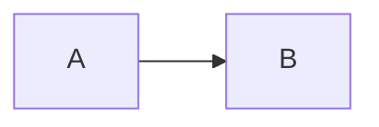

# Active Context

## Current Task: Nested Fence Detection (COMPLETED)

Added support for preserving mermaid code blocks that are nested inside other code fences.
This allows users to document mermaid syntax without the examples being converted to SVGs.

### What Was Done
- Refactored Processor to parse fence boundaries and track nesting depth
- Only processes mermaid blocks at top level (depth 0)
- Added 3 regression tests covering nested fence scenarios
- All 47 tests passing, no rubocop offenses

### Example
````markdown

````

The inner mermaid block is now preserved as code, not converted to SVG.

## Repository Status
- Branch: allow-literals
- Tests: 47 passing
- CI/CD: Configured
